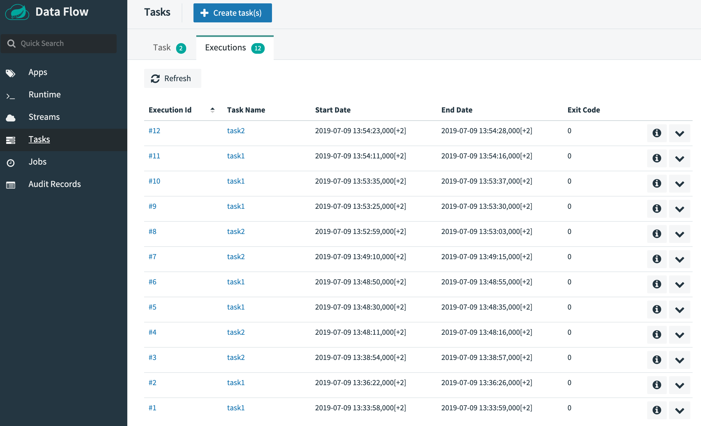

## Create custom Spring Cloud Task

Bootstrap by follow the [Task development instructions](https://docs.spring.io/spring-cloud-task/docs/2.0.0.RELEASE/reference/htmlsingle/#getting-started-developing-first-task) and then: 

* Set the POM parent to Boot 2.2.0.M4 or newer

```xml
<parent>
    <groupId>org.springframework.boot</groupId>
    <artifactId>spring-boot-starter-parent</artifactId>
    <version>2.2.0.M4</version>
    <relativePath/>
</parent>
``` 

* Add dependencies to enable the Spring Cloud Task functionality and to configure the jdbc dependencies for the task repository: 

```xml

<dependency>
    <groupId>org.springframework.cloud</groupId>
    <artifactId>spring-cloud-starter-task</artifactId>
    <version>2.2.0.BUILD-SNAPSHOT</version>
</dependency>
<dependency>
    <groupId>org.springframework.cloud</groupId>
    <artifactId>spring-cloud-task-core</artifactId>
    <version>2.2.0.BUILD-SNAPSHOT</version>
</dependency>
``` 

* Add dependencies to configure the jdbc dependencies for the task repository: 

```xml

<dependency>
    <groupId>org.springframework.boot</groupId>
    <artifactId>spring-boot-starter-jdbc</artifactId>
</dependency>
<dependency>
    <groupId>org.mariadb.jdbc</groupId>
    <artifactId>mariadb-java-client</artifactId>
    <scope>runtime</scope>
</dependency>

``` 

* Add dependencies to configure Micrometer integration: 

```xml
<dependency>
    <groupId>org.springframework.boot</groupId>
    <artifactId>spring-boot-starter-actuator</artifactId>
</dependency>
<dependency>
    <groupId>io.micrometer</groupId>
    <artifactId>micrometer-registry-influx</artifactId>
</dependency>

``` 

## Spring Cloud Data FLow server

Run SCDF locally using the Docker Compose `docker-compose-influxdb.yml` file.

To download the Spring Cloud Data Flow Server Docker Compose file, run the following command:
```
wget https://raw.githubusercontent.com/spring-cloud/spring-cloud-dataflow/v2.2.0.M1/spring-cloud-dataflow-server/docker-compose-influxdb.yml
```

The Docker Compose file starts instances of the following products:

* Spring Cloud Data Flow Server
* Spring Cloud Skipper Server
* MySQL
* Apache Kafka
* Influx DB
* Grafana with pre-registered dashboards

#### Starting Docker Compose

```
export DATAFLOW_VERSION=2.2.0.M1
export SKIPPER_VERSION=2.1.0.M1
docker-compose -f ./docker-compose-influxdb.yml up
```

#### Register and launch the custom Task

To use it, open another console window and type the following:

```
docker exec -it dataflow-server java -jar shell.jar
```

* Register the custom task application
```
dataflow:>app register --name myTask --type task --uri https://github.com/tzolov/task-demo-metrics/raw/master/apps/task-demo-metrics-0.0.1-SNAPSHOT.jar

```

* Create two tasks: `task1` and `task2` using the `myTask` application.
```
dataflow:>task create --name task1 --definition "myTask"
dataflow:>task create --name task2 --definition "myTask"
```

* Launch `task1` and `task2` couple of times
```
dataflow:>task launch --name task1
dataflow:>task launch --name task2
```

Check task execution in the SCDF UI: http://localhost:9393/dashboard/#/tasks/executions



## Grafana 

Open Grafana at http://localhost:3000 (user: `admin`, password: `admin`) and select the `Task & Batch` dashboard 


